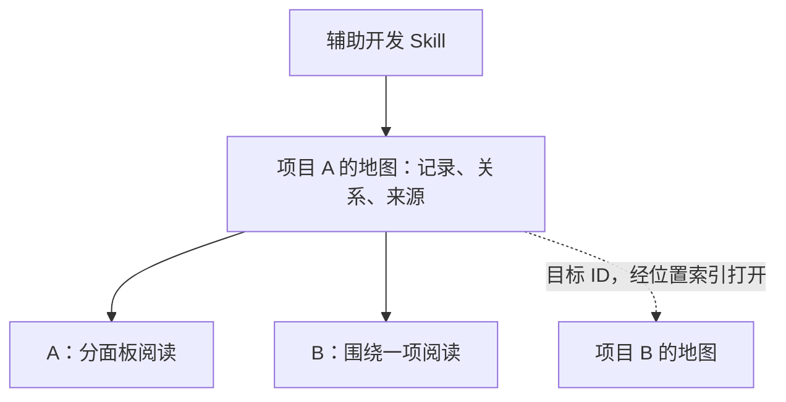

# 项目维护地图：设计方案与首版 Skill

日期：2026-09-16。状态：已构建并安装为 `$maintain-project-map`，自身项目地图已接入真实记录；A/B 页面现在默认通过本机 HTTP 地址交付。原生 Archify 核心与适配嵌入已接入；当前维护两种阅读方式；实际功能与本次检查范围见自身地图的独立实现、验证记录。长期模型对照尚未完成。

入口：[Skill](maintain-project-map/SKILL.md) · [当前实际实现](docs/project/records/implementation/release.md) · 阅读页面（历史资料或本地生成内容，未随仓库发布） · [检查记录](docs/project/records/verification/build.md) · [资产模型](maintain-project-map/references/asset-model.md) · [本地操作](maintain-project-map/references/operations.md) · [对照评估](maintain-project-map/references/evaluation.md)

## 1. 目标与核心选择

这是一个辅助开发的 Skill，为软件、插件、工作流、Skill 及其它持续演进的项目维护可阅读、可查询、可修订的资产。它同时帮助开发者理解和恢复项目认识，也帮助 LLM 定位相关知识并继续开发。独立性指它不依附某个被维护项目；交付形态仍以 Skill 为核心。

组织基础是一个项目一份地图。地图是该项目的说明、记录、关系和来源构成的维护资产，可以有多份文件和多种阅读方式；原生 Archify JSON 是其中的图资产，生成的 HTML 页面是可重建视图。借鉴 MRS 的共同项目入口（本地历史参考，未随仓库发布）：人和 AI 回到同一项目资产，再按需读取；版本管理继续复用 Git。

这里的 Module 指具有职责、Interface 和 Implementation 的模块。在软件中可以是包或插件；在工作流中可以是步骤或子流程；在 Skill 项目中可以是能力、脚本或适配部分。Interface 包括交互方式、输入输出、使用条件、错误行为和兼容约定，并须用用户能够理解的语言说明。

核心结构是：**可阅读的权威记录 + 有类型的关系 + 可重建的索引和视图 + Git 版本历史**。Skill 在工作中帮助定位、解释、修订和剪枝，连接开发者的问题与对应项目位置。代码图、目录树、Git 提交图和需求追踪图各自回答不同问题。

资产可以很丰富；模型每次读取多少材料，由当前问题决定。维持资产不应迫使模型每轮重读项目、填写整套表格或重新论证已有决定。

## 2. Skill 与被维护项目各自独立

本 Skill 的正文、格式约定、可选检索/渲染适配和评估方案放在自己的开发项目中；每个被维护项目拥有自己的资产。项目目录索引用稳定 ID 解析位置。

DSH 是检验设计的一份案例。Maintenance 是该案例中的被维护软件；本 Skill 的存储、运行和组织不依赖它。案例中的文档位置不构成通用的资产存放要求。

从案例中保留的通用结论是：复用已有编号和规范；一个需求可涉及多个项目；需求撤回必须可追溯；实现与验证分开记录；复现使用具体版本组合。具体查阅依据放在 DSH 案例（历史资料或本地生成内容，未随仓库发布），不由日常入口自动加载。

项目类型只帮助选择有用记录，不强迫套用同一种软件结构。例如工作流强调交接、输入输出及异常；Skill 强调适用场景、能力组合与行为约定；应用强调功能、模块及外部依赖。

## 3. 一个项目对应什么资产

“项目”按长期维护职责识别，不直接等同于一个目录、仓库或会话。

| 对象 | 身份与职责 |
|---|---|
| 项目地图 | 一个项目的能力与规格、设计思路、对象、交互逻辑、实现、关系和历史；各阅读方式共享 |
| 外部地图引用 | 当前地图保存目标项目 ID、可选条目 ID 及必要说明，通过位置索引打开对方地图 |
| 仓库 | 资产和代码的版本载体；一个项目可以绑定多个仓库，一个仓库也可承载多个明确分区的项目 |
| 工作树 | 同一项目在某条开发分支上的视图，沿用项目 ID |
| 会话 | 需求和决策的来源；一条会话可涉及多个项目，一个项目可跨多条会话 |
| 本地项目目录索引 | 将稳定项目 ID 解析到本机位置；保存位置，不另存一份项目事实 |

当前地图就是默认维护和查询范围。跨项目协作保持轻薄：用 ID 找到另一张地图，按需打开有关条目。依赖关系不自动产生一个共同父项目或全局关系平台；只有用户另行定义了独立维护的组合项目时，才将其作为普通项目建图。



这是单项目地图、阅读方式与外部引用的示意。一个事实由明确负责的项目记录，其它地图引用它。资产默认贴近项目保存，也允许注册独立目录；物理位置和阅读方式不改变项目身份。跨项目不复制对方整张地图，也不要求双向同步。

## 4. 资产如何组织

新项目可采用以下布局；已有项目优先绑定已有文件，不为了目录整齐而迁移。

```text
repo/
  docs/project/
    project.yaml             稳定身份、文档位置、仓库和外部项目绑定
    map.md                   项目共同入口：能力、设计、对象、现状与关键链接
    records/                 有实际内容后再建立
      requirements/          需求与验收条件
      objects/               关键对象及其定义、归属与生命周期，按需建立
      modules/               职责、边界、代码入口
      interfaces/            面向用户的交互说明，链接技术约定
      decisions/             决策、原因、被替代的方案
      explorations/          有复用价值的探索与结果，按需要建立
      implementation/        已实现功能、使用方式、当前限制与代码/产物定位
      verification/          检查范围、证据、结果与适用版本，供按需核查
    diagrams/                原生 Archify JSON 图源，通过清单关联正文记录
    views/                   按需生成的阅读页面、图源快照和交付回执
  .project-map-cache/        可重建的本地索引，不提交
```

`project.yaml` 是小型定位清单；正文放在 Markdown 中。新增记录可用少量 YAML 元数据存稳定 ID、状态和关系。现有需求表可由清单绑定“文件 + 条目编号”，不要求拆成几百个文件。

每个事实只有一个编辑位置。Markdown 记录、现有规范文件、声明的关系与显式维护的原生 Archify JSON 是源资产；图源通过清单绑定记录，按实际职责与执行证据编写。阅读页面和图形由这些资产生成，反向关系与查询结果按当前记录计算；不会仅凭文档链接自动推断完整架构或执行顺序。代码的实际行为仍要通过代码和运行证据确认。

人读入口主要回答“现在是什么情况、接下来去哪里”；AI 搜索返回少量候选及精确定位。两者共享底层记录，不各维护一套结论。视图没有新建工具时可以暂时手工整理，但其摘要不承担规范权威，并记录来源版本。

### 项目说明与规格的范围

功能指该项目能做什么，包括后台处理、内部能力和供其他项目使用的能力。项目说明还需要包含目标与范围、设计思路、关键对象、对象关系、交互逻辑、模块组织及扩展约定。按内容需要组织章节，不要求每个项目机械填满模板。

例如当前设计草案中的“地图和记录是什么”“为何一项目一地图”“外部引用怎样解析”“退役与失败探索如何区分”，都是项目地图应保存的知识。它们可以在同一篇文档中按章节定位，无需全部改名为功能或拆成独立文件。

### 面向用户的接口说明

每个重要 Interface 的入口应让用户理解：为什么需要它、谁把什么交给谁、接收方做什么、最后得到什么、失败会怎样、改变它会影响谁。先给具体例子或适当的流程/时序图，再链接字段、协议、schema 和兼容细节。

例如“工作流调用整理 Skill”：用户入口解释收到哪些材料、生成什么笔记、来源链接是否保留、失败后从哪里重试；技术详情才解释参数、返回结构和版本。两者绑定同一个 Interface ID，不能各自演进成相互矛盾的约定。

### 实现与验证分开存放

`implementation/` 保存用户平时阅读的当前功能、使用入口、实际行为及已知限制。`verification/` 独立保存测试范围、运行证据、环境与尚未覆盖的场景，两者通过实现 ID/版本相连。

日常阅读应容易到达实现说明，验证详情按需打开。会影响使用判断的已知问题或“尚未验收”等状态用简短标记保留在实现页；分开存储不表示可以将未验证行为写成已验证事实。将当前功能文档作为主页是一种候选阅读方式，尚未定案；详细验证仍保留独立入口。

### 开发者如何看清楚、想明白和提问

阅读从用户的目标和功能叫法进入，并能逐步展开流程、职责、设计理由和原文位置。目录结构负责存储；用户不需要先记住 Module 名称或文件路径。

- 回来继续：知道要做什么、已经有什么、哪些尚未完成或待决定。
- 看懂功能：用具体输入输出和例子解释实际行为，再展开协作结构和使用限制。
- 理解决定：看到为何这样设计、当时的约束、未选方案及何时值得重新考虑；没有记录时明确缺口。
- 找回记忆：支持旧称、模糊功能描述、来源会话，以及退役或合并后的去向。
- 继续提问：通过现有会话 harness 正常提问，可以指出功能名称或引用对应内容；LLM 定位相关记录，回答和改动能回到原处。

阅读提供两种方式：A 项目概览，分别展示说明与规格、整体组织和功能路径；B 项目条目，在可展开模块目录中选择一项，阅读说明、现状、接口和关系。Archify 架构看板与流程图保留为阅读子模块，采用白色为主、黑色为辅的界面，提问沿用现有会话 harness。已连接真实项目记录并迁入固定版本 Archify 的原生图模型、校验交付与交互阅读器。当前导出默认 A，可用参数或页面内切换 B。

两种方式共用项目身份、规范正文、记录、关系、来源及状态，分别负责导航、排版和聚焦。Archify 看板与流程图在两种页面中适配嵌入；原生图文件保留身份、分组、布局与显式连线，通过独立映射与文档记录关联。日常改动先维护权威记录，当前需要的视图再按需生成；无需每轮开发加载或更新全部展示模块。详见[阅读与交互](maintain-project-map/references/reading-and-interaction.md)。

默认阅读入口已按用户后续选择改为本机 HTTP 地址：生成命令启动或复用本地预览服务，回执提供当前链接。纯 HTML 文件保留为可选离线导出。服务只监听本机、不调用模型，也不会自动更新源记录；同一服务运行期间复用地址，停止或重启电脑后重新取得当前链接。详见 [REQ-http-entry](docs/project/records/requirements/http-entry.md)。

进度与缺口从同一组功能/规格和实现记录整理：前者说明当前阶段，后者说明尚缺内容、影响与必要决定。不得把模型新增的改进建议混为已经确定的缺口；实际情况未核查时保留相应标记。

功能表达项目能做什么，项目对象表达被定义和操作的概念，模块表达实现职责，流程表达交互怎样发生；它们不是一一对应关系。阅读视图同时容纳设计思路和规格正文，跨项目用薄引用连接另一张地图。具体页面与检查范围以自身项目地图的当前实现和验证记录为准。

人和 LLM 共享同一组事实：人侧优先解释用途、关系和原因；模型侧按问题拿精确引用、状态与必要正文。无需为了让人易读而把整套展示内容注入模型上下文。

## 5. 需要保存的关系

最有用的一条链是：

**需求 → 设计决定 → Module/Interface → 实现记录**；验证记录另外连接到对应实现版本与验收条件。

地图内关系按需要带类型，例如 `implements`、`consumes`、`provides`、`verifies`、`supersedes`、`derived_from`。外部引用最少用目标项目 ID，精确定位时加条目 ID；仅在涉及真实依赖或版本核查时补充关系、兼容条件和证据，不给普通跳转强加完整依赖协议。

例如，整理 Skill 改变输出文件组织方式，会影响读取该产物的工作流与应用；仅改变 Skill 内部脚本的局部变量，不应自动宣布所有消费者失效。

变更传播的结论先是“需要核对哪些记录/实现”，具体缺陷要读代码或验证才成立。导入关系可以自动抽取；“这个设计满足哪条用户需求”需要可回查的判断依据。

关系图可以有环，不能因为借鉴研究地图就把全部关系限制成 DAG。Git 提交历史和记录修订历史继续使用 Git。

## 6. 工作中的维护方式

### 新需求

在需要据此实施前，保存简短的新增/修订要求，附用户来源和验收描述。含糊的部分标为待明确；已经明确授权的要求不再逐条请求批准。单纯询问可行性，不自动成为实施承诺。

### 实施与完成

正常推进开发；在相关决定明确、变更完成或任务需要交接时，补充受影响的记录。实现变化写入实现记录，检查范围与证据写入独立验证记录；需要时相互链接。避免每次工具调用后写维护日志。

### 需求变更

显式关联被替代的要求。旧来源可以搜索到，但默认面向当前工作的结果应同时显示其后继。不能为了让已有代码“满足需求”而反向改写用户意图。

### 剪枝、退役和探索

维护允许增加、改写、合并和删除冗余。需要区分阅读折叠、记录合并、功能退役和探索整理；改变显示范围不等于改变功能，实现移除也不能只靠修改说明完成。

失效模块可按已经明确的需求与授权移除，核对相关有效需求和消费者。保留简短的原身份、退役原因、替代去向及历史版本定位；正常工作的功能因目标改变而退役，不应被标为失败。

失败探索保存尝试的问题、路线、失败条件、证据与重新考虑条件。未采用或暂停与失败分开。探索过程的噪声可删，未来可能复用的经验按需保留；默认当前视图可以很短。详见[生命周期与剪枝](maintain-project-map/references/lifecycle.md)。

### 新会话继续

通过项目清单找到当前分支资产，先看相关需求和未完成项，再打开必要原文。没有证据支持的历史结论保留不确定状态。

### 小改动和无变化

修正拼写、查看一个值、只改内部实现且没有值得保留的变化时，可直接完成任务而不更新地图。没有资产变化是正常结果。

### 初次接入

先登记身份、现有规格、关键模块和当前问题。历史补录是一项单独、有范围的工作；不能让接入 Skill 变成每次开发前必须完成的全仓库普查。

## 7. 如何避免 Skill 拖累模型

2026-09-11 的 OpenAI 文章明确讨论了长描述、误触发、过度规定步骤和强制全量读文档的问题；本方案采用短入口和按需加载。[Rethinking skills and prompts for GPT-6 Astra](https://developers.openai.com/blog/rethinking-skills-and-prompts-for-gpt-6-astra)

具体约束：

- 只处理项目知识的持续维护与检索。模型自行选择编码、设计和调试方法。
- 描述要能排除相邻但无关的任务，完整资产不能放进 Skill 描述或 AGENTS.md。
- 入口只说明何时读取什么、什么事实值得写回。数据模型、会话检索、评估分开按需读取。
- 重用已读且仍适用的上下文，先用精准定位，再扩大范围；避免同一份材料反复读。
- 不增加固定思考步骤、每轮报告、每次提交要求或额外审批。不从设计上的完备性推导日常工作负担。
- 索引或渲染暂时失效时，可读源文件并继续与故障无关的工作；明确尚未完成的维护部分。
- 维护成本进入评估：输入量、调用数、耗时、无关编辑、额外确认次数及长期交接质量。

首版已完成工具功能测试和一次独立前向使用，但尚无完整对照结果证明该 Skill 优于基线。判断方法见[对照评估](maintain-project-map/references/evaluation.md)，不能用文档更长或图更大代替收益证据。

首版入口文本为 1,040 token；入口与全部六份参考说明约 6,900 token，按 `o200k_base` 静态计数，仅说明文本规模，不要求同时加载。早期更长的设计材料已留在开发资料中，没有一起安装。实际成本需要计入首次接入、任务内的多次模型请求、维护、返工与按需阅读生成。先比较同等预算下的质量和达到同等验收要求的总成本，再确定开销目标；详见[维护成本与收益](research/cost-and-benefit.md)及[首版试用](research/first-build-check.md)。收益和可接受增幅尚未确定。

采用模型基于上下文自然选用 Skill 的方式。当前设计不增加强制触发、常驻维护、定时监控或为保证调用而修改项目指令的机制。

## 8. 长会话中段如何找到

本轮使用了两类读取方式：Codex 的会话读取接口，以及在接口返回空正文或大段截断时对指定会话本地记录的补查。读取接口支持向前翻页；它不等于一个已经建好的全库语义搜索引擎。

本地检索先由会话 ID 找到对应记录文件，再提取用户消息等相关内容，用关键词筛选，最后回读命中前后的消息并核对后续修订。文件很大并不要求全部进入模型上下文。

一个已实际找到的中段例子：2026-09-14 17:39（上海时间），用户要求“检查整个系统可运行性，是否符合设计与功能需求文档”。消息身份为 `msg_01a09f48-cf08-7c00-8749-ee089f6e4924`，在本轮查阅文件的第 3435 行。后面的第 8783 行包含删除全局会话思维图并更新需求文档的明确要求。

本地证据：中段要求（本地历史参考，未随仓库发布）、后续需求修订（本地历史参考，未随仓库发布）。行号用于辅助打开，稳定身份还需消息 ID 和来源校验。

当前可见上下文、压缩后的上下文、磁盘上的会话记录是不同东西。压缩帮助延续任务，不能代替任意历史原话的精确检索；这里也未假定能解读宿主的内部压缩表示。[OpenAI Compaction](https://developers.openai.com/api/docs/guides/compaction)

建议后续将“用户请求—需求条目—设计决定—代码/验证”建立结构索引，搜索先找候选，再按稳定位置读正文。这样“当时为什么这么设计”可以从资产返回原会话证据。原始日志保持宿主所有，缓存和摘录按最小范围保存；不依赖私有推理内容。

## 9. 可以借鉴的已有方案

| 方案 | 已有能力 | 本方案借鉴点 |
|---|---|---|
| [Structurizr / C4](https://docs.structurizr.com/) | 同一模型生成多层架构图，适合 Git 管理 | 一套关系模型派生系统、模块和流程视图 |
| [Backstage](https://backstage.io/docs/features/software-catalog/system-model/) | 目录中组织软件、Interface、资源和系统关系 | 稳定身份、Interface 归属和跨项目发现 |
| [DeepWiki](https://docs.devin.ai/work-with-devin/deepwiki) | 从仓库生成架构图、说明和源码链接 | 自动建立代码理解入口、源码回链和按问题阅读 |
| [Archify](https://github.com/tt-a1i/archify) | 结构化图源、交互架构/工作流等视图、版本图对比与导出 | 已迁入原生五种图模型、CLI 与交互阅读器；A/B 适配架构与流程，项目档案与 ID 登记作为补充层，详见[归属与版本](maintain-project-map/assets/vendor/archify/ATTRIBUTION.md) |
| 本地 MRS（本地历史参考，未随仓库发布） | 研究记录、证据、修订、依赖与派生阅读地图 | 条目可回查、历史可保留、结论与证据状态分开 |

上表区分参考能力与实际集成范围。代码生成的说明需要与用户需求对照；MRS 的数学审查与独立存储协议有特定用途，本项目可借用记录观念而继续复用 Git。软件产品的目标允许通过明确需求变更演进，不套用数学主目标不可变规则。

## 10. 首版交付与后续验证

1. 已实现一项目一地图的初始化、登记、读取与已有文档绑定；本 Skill 自身使用这一方式维护设计与实际状态。
2. 已实现词面/别名查询、局部关系、分段来源、记录合并与退役，复用 Git；没有引入独立对象库。
3. 已实现共用真实记录的 A/B 页面，直接维护原生 Archify 图源并通过上游 CLI 校验交付，适配浅色嵌入及记录到节点的多对多关联。阅读行为和本次检查结果独立记录；通过图源检查不等于完成全部视觉验收。
4. 51 项功能检查与一次独立前向使用完成，其中 HTTP 入口专项为 7 项；完整无 Skill/有 Skill 多轮开发对照尚未运行。后续按原评估设计加入模糊指令、逐步补充需求和换会话继续；现成基准与运行器见调研（历史资料或本地生成内容，未随仓库发布）。

LLM 在原有会话中使用本地脚本完成机械操作，并直接修订原文；可视化用于阅读和理解。没有另建提问系统或 MCP 服务。本地 HTTP 预览按需启动，可以停止，空闲 8 小时后退出。

本轮交付包括安装后的 Skill、运行脚本、真实项目地图、阅读页面和固定版本的 Archify 运行资源。实际能力与限制见[实现记录](docs/project/records/implementation/release.md)，检查结果与未覆盖范围见[验证记录](docs/project/records/verification/build.md)。
